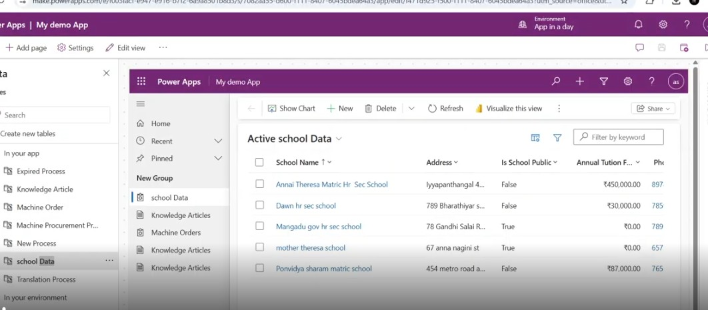
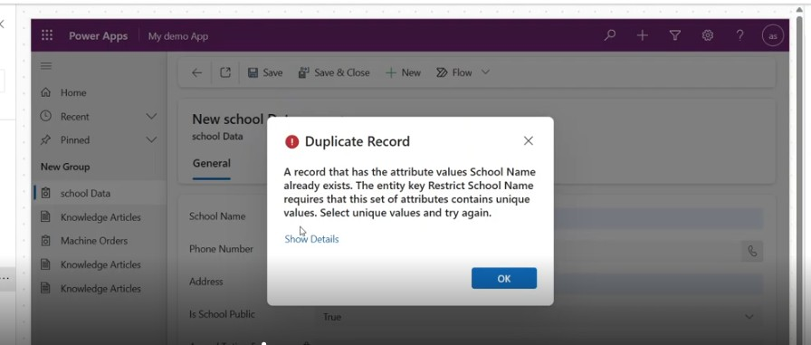
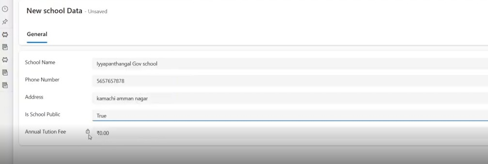
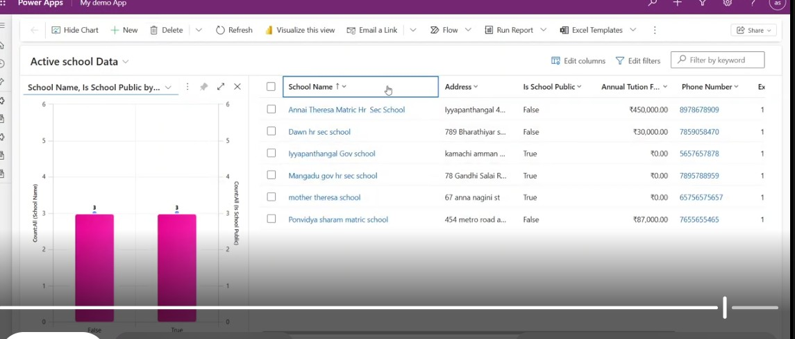

 School-Data-Management-
A Model-Driven School Data Management App built using Dataverse with business rules and alternate keys.

The School Data Management System is a Model-Driven application built using Microsoft Dataverse to efficiently manage school-related data in a centralized and structured manner.

This application leverages no-code/low-code capabilities to automate data handling, enforce validation rules, and improve data consistency.

Features
- Centralized storage of school data using Dataverse tables
- Automated tuition fee to set 0 for public school by using business rules
- Unique school name validation using alternate keys
- Structured and secure data management
- User-friendly model-driven interface

Technologies Used
- Microsoft Power Apps (Model-Driven App)
- Dataverse
- Business Rules
- Alternate Keys

Key Highlights
- Eliminates manual data entry errors
- Ensures data uniqueness and consistency
- Automates fee calculation logic
- Scalable solution for educational institutions

🎥 Demo Video https://drive.google.com/file/d/1fSNJBAlItQgtLMe8fi3AtvTXS3bjpsPL/view?usp=sharing

 📸 Screenshots

**1. Active School Data**

**2. Business Rule Apply**

**3. Duplicate Entry Restriction**

**4. New School Record (Business Rule Applied)**

**5. Public vs Private Schools Chart**

